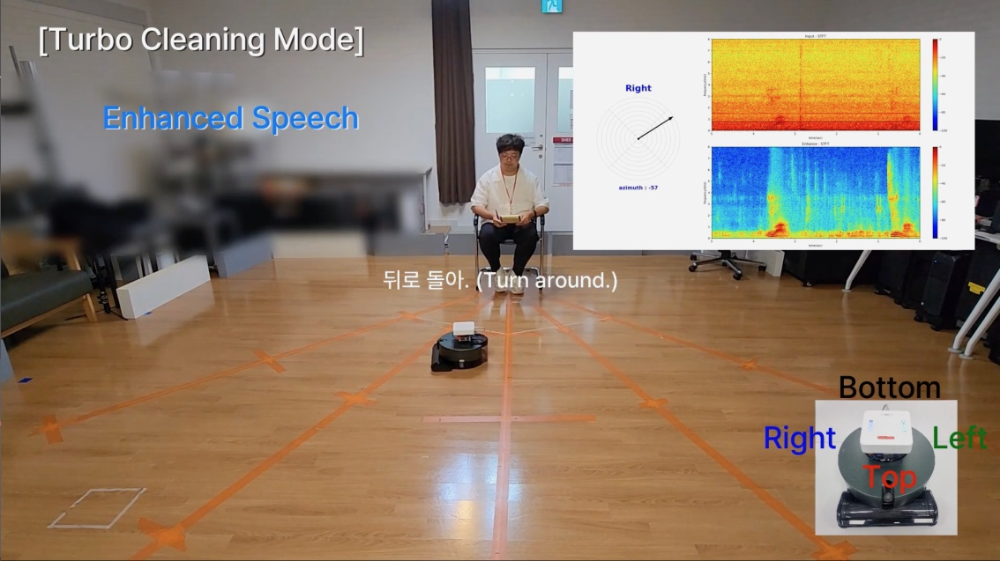

<!-- 
## Description

## Tech
'*' : tech I focus on

## My job -->

# Task Describtion
Developing a direction detection system for single-source audio in extreme noise environments, designed for robot vacuums equipped with multiple microphones.
 

## Background
In noisy environments, especially in hardware-constrained robot vacuums, it is challenging to accurately detect the direction of a single audio source while reducing noise in real-time.
 

## Proposed Solution
* System: Designed an integrated system that efficiently combines noise reduction and direction detection algorithms in real-time.
* Noise Reduction Module: Developed a lightweight noise reduction model (Tiny Recurrent U-Net) optimized for low-latency real-time operation on limited hardware.
* Source Localization Module: Enhanced direction detection by utilizing the output of the noise reduction module, applying a Signal-to-Noise Ratio mask and Recursive Least Squares for noise estimation.
 

# Outcome
## Demo

* **[Journal, Patent]** J. -H. Kim, **Taehan Kim**, S. -H. Kim, J. -M. Song, Y. -J Park, Hyung-Min Park. **A Real-Time Sound Source Localization System for Robotic Vacuum Cleaner with a Microphone Array.**  Submitted to IEEE Sensors Journal*(2024) /Applying for KR, US Patent(2024W) 
* Ongoing collaboration with LG Electronics to apply single-channel noise enhancement technologies to robot vacuum systems.
 

# My Contributions
* Developed a real-time noise reduction model optimized for limited hardware.
* Contributed to the enhancement of the direction detection algorithm by utilizing noise reduction results.
 