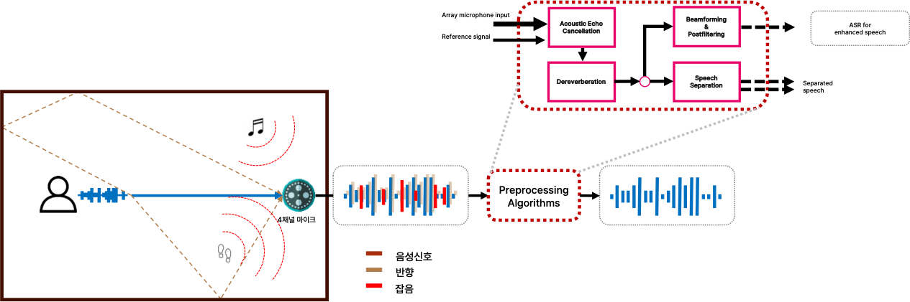

<!-- 
## Description

## Tech
'*' : tech I focus on

## My job -->

# Task Describtion
Developing multi-channel preprocessing technology for noisy and echo-prone kiosk environments, focusing on echo cancellation and beamforming techniques.
 

## Background
In noisy and echo-laden environments like kiosks, it is difficult to accurately process speech signals for proper recognition and direction detection.
 

## Proposed Solution

  

* System: Created an integrated system that combines echo cancellation, reverberation removal, and mask-based beamforming.
* Echo Cancellation: Implemented a Weighted Prediction Error (WPE) algorithm for multi-channel echo cancellation.
* Beamforming: Applied a Coherence-to-Diffuse Ratio (CDR) mask for beamforming to enhance directional signal processing.
 

# Outcome

  
  

The system is currently under development with collaboration from NCSoft, focusing on deployment in kiosk environments.
 

# My Contributions
* Developed the echo cancellation and beamforming algorithms.
* Ported the system to C++ for deployment in real-world kiosk environments.
 