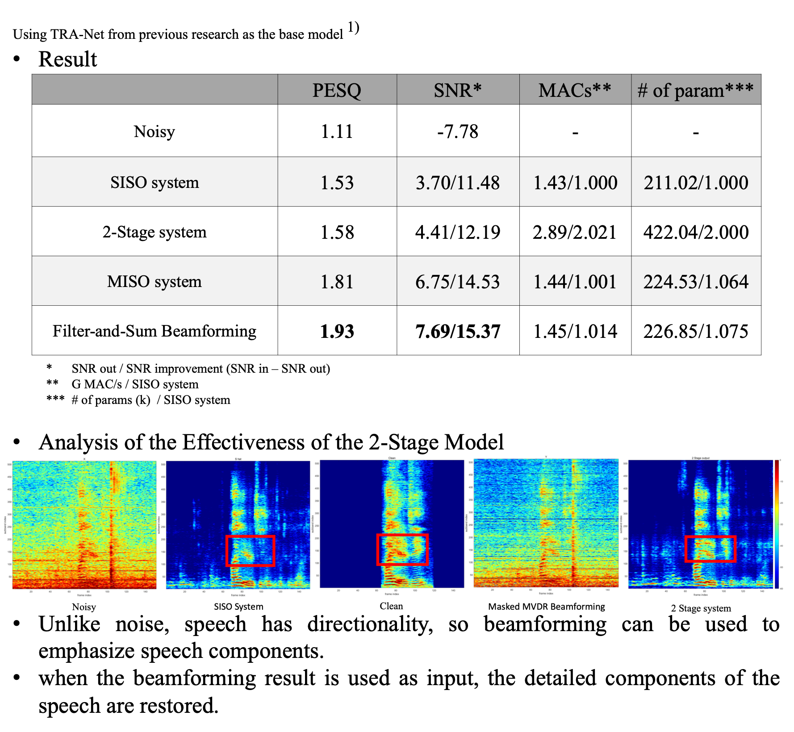

<!-- 
## Description

## Tech
'*' : tech I focus on

## My job -->

# Task Describtion
The project focuses on enhancing the quality of speech in **low SNR conditions** by utilizing a **multichannel microphone system**. This system leverages the spatial correlation between noise and speech to effectively suppress background noise in real-time, improving the clarity of speech for tasks such as speech recognition.
 

## Background
* Lightweight speech enhancement models suffer from degraded performance in low SNR conditions.
* Single-channel microphones provide limited information, making it difficult to separate speech from noise.
 

## Proposed Solution
* A multichannel microphone system provides more spatial information, enabling better separation of speech and noise.
* Various models such as single-channel and multichannel setups were analyzed and compared in terms of speech quality improvement and computational efficiency.
* 
 

# Outcome

  

 

# My Contributions
* Developed and tested multiple real-time speech enhancement models using multichannel input.
Analyzed and compared the results of various methods, such as single-channel and multichannel setups, for speech enhancement.
* Conducted experiments with SNR improvement, PESQ scores, and other metrics to validate the models' effectiveness.
* Filter-and-Sum Beamformer System: The idea for this method came from analyzing **traditional beamforming techniques**, where the final output is a sum of channel-wise outputs, each weighted appropriately. This is conceptually similar to deep learning, where each channel's output is weighted by the model.
  * Inspired by this analogy, the Filter-and-Sum approach was applied to the deep learning output as well. By summing the outputs from each channel in the model, the system can effectively make use of spatial information to enhance speech while suppressing noise.
  * This method optimally combines the outputs from different microphone channels, leading to significant improvements in speech quality without a substantial increase in computational complexity.
 