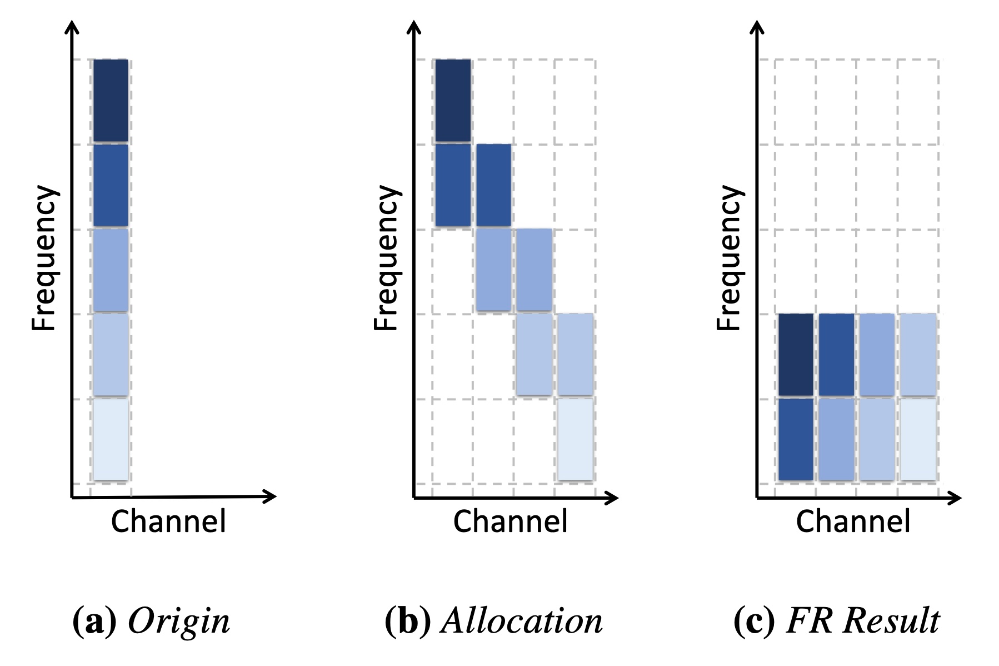
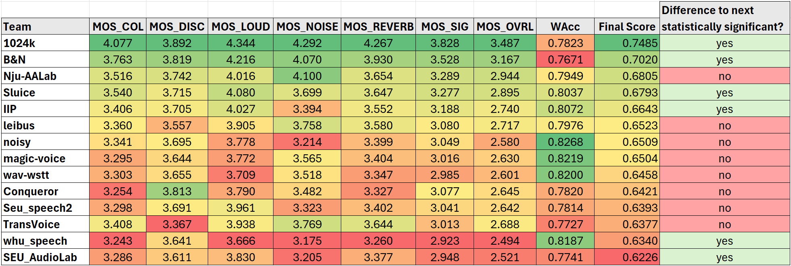

<!-- 
## Description

## Tech
'*' : tech I focus on

## My job -->

# Task Describtion
This project was part of the Speech Signal Improvement Challenge 2024, where we participated in the Real-time track. The main objective was to improve speech signal quality in real-time, targeting environments with diverse noise sources and challenging acoustics. 
 

## Background
The challenge evaluated speech enhancement systems in both real-time and non-real-time tracks. The real-time track, in particular, focused on improving speech quality for communication systems in noisy environments, considering metrics like Word Accuracy (WAcc) and ITU-T P.835 subjective evaluations. We developed an advanced deep learning model that successfully enhanced speech signals in real-time, addressing issues like low signal-to-noise ratio (SNR), reverberation, and interference from multiple speakers.
 

## Proposed Solution

  

* Frequency Rolling (FR) : This process effectively rolled the frequency axis into the channel axis, allowing grouped convolutions to handle the frequencies separately with a reduced computational footprint.
* Frequency-wise Self-Attention with Time-wise LSTM for Causality
 

# Outcome

  

We ranked 5th out of 13 teams in the Real-time Track.
 

# My Contributions
* I applied Frequency Rolling (FR) because I found it effective in reducing computational complexity without significantly degrading performance. This approach has been successfully used in previous research on music separation, where rolling the frequency axis into the channel axis improved efficiency while preserving the model's capacity to handle frequency domain information.
 